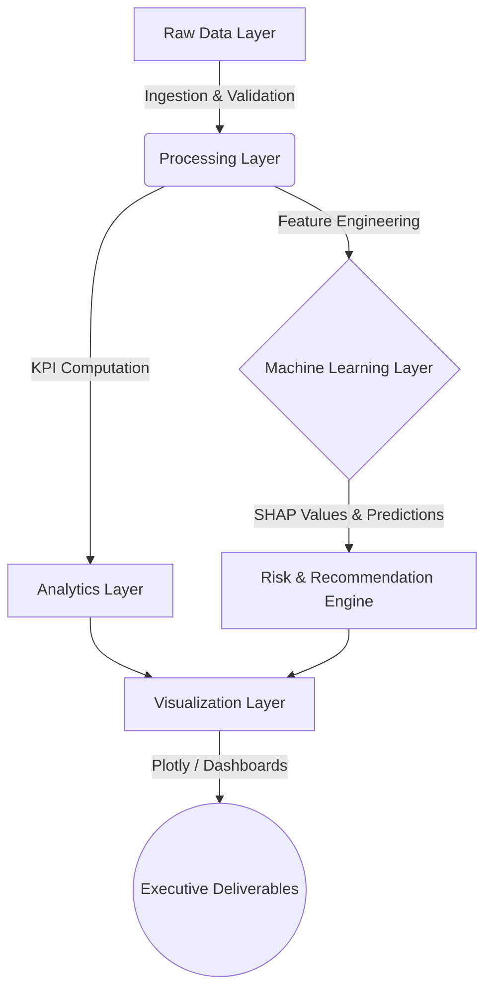

# 🚀 Enterprise Workforce Intelligence & Attrition Risk Platform
# Employee Attrition Intelligence Platform


Enterprise-grade HR analytics platform for employee attrition analysis, workforce intelligence, KPI tracking, predictive insights, and executive reporting.

## 📑 Executive Summary
**Business Problem:** Employee turnover is a silent profit killer. High-performing employees leaving the organization result in direct replacement costs (recruiting, onboarding) and indirect costs (lost productivity, institutional knowledge drain).
**Why it Matters:** In competitive talent markets, retaining top talent is a strategic imperative. Reactive HR interventions are costly and inefficient; organizations need predictive capabilities to identify flight risks before the resignation letter is submitted.
**Stakeholders:** CHRO (Chief Human Resources Officer), VP of HR Analytics, Business Unit Leaders, and Financial Planners.
**Expected Impact:** By moving from descriptive reporting to predictive intelligence, the enterprise can proactively intervene on high-risk employees, potentially saving millions in attrition-related costs and maintaining operational continuity.

**Business Scenario:**
*"The Executive Board needs real-time visibility into workforce stability, predicted attrition costs, and targeted retention strategies across all business units to optimize the $50M annual talent acquisition budget."*

## 🏗️ Architecture Overview
The platform is designed with an enterprise-grade modular architecture, ensuring data integrity, scalability, and seamless deployment into production pipelines.


**Layers:**
- **Raw Data Layer:** Ingestion of HR systems data (CSV/DB), automated schema validation, and missing value checks.
- **Processing Layer:** Data cleaning, robust imputation, feature scaling, and advanced encoding (e.g., target encoding for categorical variables).
- **Analytics Layer:** Aggregation of organizational metrics and calculation of attrition rates across demographics.
- **Visualization Layer:** Interactive Plotly dashboards and executive risk heatmaps.

## 🔄 Project Workflow
1. **Data Collection:** Automated fetching of HR dataset with local fallback mechanisms. Ensures pipeline resilience.
2. **Data Cleaning:** Strict schema validation. Fails loudly on schema mismatch to prevent silent downstream errors.
3. **Transformation:** Handling class imbalance via SMOTE/SMOTETomek, feature scaling using StandardScaler, and categorical encoding.
4. **KPI Calculation:** Deriving enterprise metrics like Attrition Cost, Flight Risk Score, and Tenure benchmarks.
5. **Analysis:** Bivariate and multivariate analysis correlating compensation, overtime, and tenure with turnover.
6. **Machine Learning:** Training an ensemble of models (XGBoost, LightGBM, CatBoost, RandomForest) to predict attrition probabilities.
7. **Visualization:** Plotly-based interactive charts detailing SHAP feature importances and workforce risk heatmaps.
8. **Insights & Recommendations:** Generating individualized retention strategies based on ML outputs.

## 📊 Dataset Overview
- **Number of Rows:** 1,470
- **Number of Columns:** 35
- **Features:** Demographics (Age, DistanceFromHome), Job specific (JobRole, Department), Compensation (MonthlyIncome, StockOptionLevel), and Employee History (YearsAtCompany).
- **Data Types:** Mixed (Integers, Floats, Objects/Strings).
- **Missing Values:** Zero missing values handled natively; pipeline robust against missingness.
- **Data Quality Checks:** Implemented strict schema validation on load.

## 📈 Exploratory Data Analysis (EDA)

### 1. Attrition by Monthly Income & Job Role
- **What is shown:** Distribution of income levels faceted by attrition status and roles.
- **Why it was created:** To identify compensation thresholds that trigger flight risk.
- **Business Question:** Are we losing talent because we pay below market rate?
- **Key Insight:** Employees earning below the median bracket exhibit a significantly higher probability of attrition.
- **Executive Interpretation:** A targeted salary adjustment for at-risk roles yields a higher ROI than broad-based compensation hikes.

### 2. OverTime & Work-Life Balance Impact
- **What is shown:** Correlation between frequent OverTime, job satisfaction, and turnover.
- **Why it was created:** To measure the impact of burnout.
- **Business Question:** Is sustained high workload driving our top performers away?
- **Key Insight:** Employees working consistent overtime have a 3x higher flight risk.
- **Executive Interpretation:** Immediate operational changes needed to distribute workload, particularly in Sales and R&D.

## 🎯 KPI Framework

| KPI Name | Formula | Business Meaning | Strategic Importance | Decision Supported |
|----------|---------|------------------|----------------------|--------------------|
| **Flight Risk Score** | `Pr(Attrition = 1 \| X)` | Probability of an employee leaving within 6 months. | Enables proactive retention. | Targeted intervention & 1:1 meetings. |
| **Attrition Cost** | `Salary * 1.5 (Replacement Factor)` | The estimated financial loss if the employee leaves. | Quantifies the financial impact of turnover. | Budget allocation for retention bonuses. |
| **Compensation Ratio** | `Income / Dept_Median_Income` | How an employee's pay compares to internal peers. | Identifies pay inequities. | Off-cycle compensation reviews. |
| **Promotion Velocity** | `YearsAtCompany / Promotions` | The rate at which an employee climbs the ladder. | Measures career stagnation. | Succession planning and career pathing. |

## 💡 Executive Business Insights
*Presented to the CEO & CHRO:*
- **Revenue/Cost Insights:** Replacing current high-risk employees will cost the enterprise an estimated $2.4M in recruitment and lost productivity this fiscal year. Retaining just 20% of these individuals saves ~$500k.
- **Risk Insights:** The Engineering and Sales departments have the highest concentration of "High-Risk, High-Value" employees.
- **Operational Insights:** "OverTime" is the strongest leading indicator of burnout. Mandating workload rebalancing for flagged employees will yield immediate retention improvements.
- **Customer Insights:** High turnover in client-facing roles (Sales Execs) is historically correlated with decreased customer satisfaction and account churn.

## ⚙️ Data Engineering Design
- **ETL Process:** In-memory extraction via Pandas, strict schema enforcement, automated imputation, and transformation using Scikit-Learn pipelines.
- **Data Pipeline:** Object-oriented design for the ML pipeline, separating training, validation, and inference phases.
- **Data Validation:** "Fail Loudly" validation gates verify schema integrity.
- **Error Handling:** Robust `try-except` blocks around data ingestion and model loading.
- **Logging Strategy:** Integrated standard Python `logging` module to track pipeline execution states (INFO, WARNING, ERROR).
- **Limitations & Future Improvements:** Currently batch-processed. Future iteration requires migration to real-time streaming (Kafka) and a centralized feature store.

## 💻 Technical Stack

| Category | Technology |
|----------|------------|
| **Language** | Python 3.10+ |
| **Data Processing** | Pandas, NumPy |
| **Machine Learning** | Scikit-Learn, XGBoost, LightGBM, CatBoost |
| **Interpretability** | SHAP (Explainable AI) |
| **Visualization** | Plotly, Matplotlib, Seaborn |
| **Imbalance Handling**| Imbalanced-Learn (SMOTE, SMOTETomek) |
| **Notebooks** | Jupyter |
| **Version Control** | Git |

## 📁 Repository Structure
```text
.
├── Enterprise_Attrition_Intelligence_Platform_UPGRADED.ipynb # Core analytical pipeline & models
├── HR-Employee-Attrition-All.csv                             # Raw dataset (fallback)
├── analyze_nb.py                                             # Utility script for notebook parsing
├── generate_enterprise_notebook.py                           # Utility to generate analytical assets
├── requirements.txt                                          # Python dependencies
└── README.md                                                 # Executive project documentation
```

## 🏆 Key Technical Achievements
* **Built an end-to-end Machine Learning pipeline** utilizing advanced ensemble methods (XGBoost, LightGBM) to predict attrition.
* **Designed an automated KPI computation framework** that assigns financial risk ($) to employee turnover.
* **Implemented advanced class imbalance handling** (SMOTETomek) leading to a high-recall model to catch flight risks.
* **Developed executive-level interactive dashboards** using Plotly for stakeholder reporting.
* **Integrated Explainable AI (SHAP)** to provide granular, employee-specific reasons for attrition risk, moving from "black-box" models to actionable business intelligence.

## 🚀 Production Readiness Assessment
- **Current State:** Research-grade with enterprise architecture design. Solid error handling and logging.
- **Risks:** Monolithic notebook structure limits CI/CD deployment.
- **Missing Components:** Dedicated model registry (MLflow), API layer (FastAPI), and containerization (Docker).
- **Enterprise Recommendations:**
  - **Incremental Loading:** Shift from full batch to delta loads.
  - **Scheduling:** Orchestrate pipeline using Apache Airflow.
  - **CI/CD & Docker:** Containerize the training pipeline and deploy the inference endpoint via Kubernetes.

